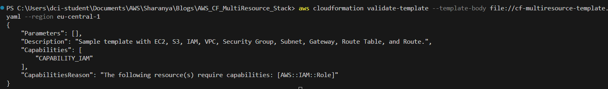
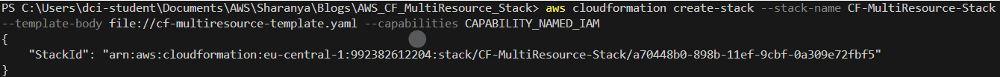
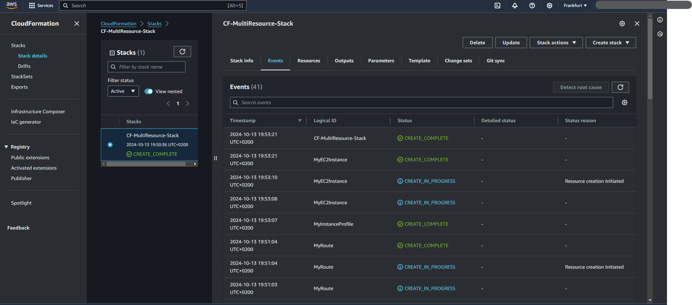
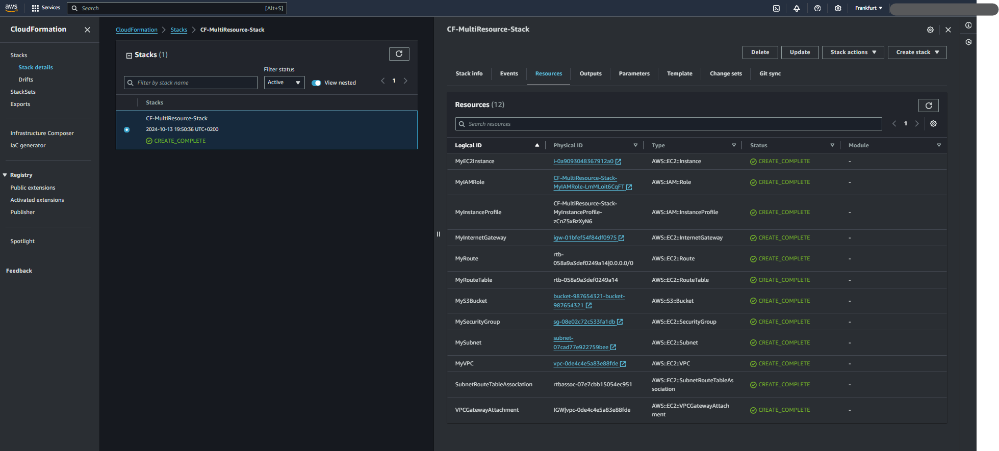

# AWS CloudFormation: A Guide to Multi-resource Deployment (EC2, S3, IAM, VPC)

In the rapidly evolving world of cloud computing, automating infrastructure provisioning is critical. AWS CloudFormation (CF) enables developers and cloud architects to define and manage their infrastructure in a systematic, repeatable manner using code. This blog will walk you through a simple CloudFormation YAML template to build and deploy a multi-resource stack. It will cover services such as Amazon EC2, S3, IAM, and networking components like VPC, Subnets, Security Groups, and Internet Gateways.

## Prerequisites:
Before diving into the CloudFormation template, ensure you have:
- Basic understanding of AWS services such as EC2, S3, IAM, and VPC.
- AWS CLI installed and configured.
- AWS Management Console access.
- A key pair to use with EC2 for SSH access.
- VSCode editor.

---

## What Are CloudFormation Resources?

AWS CloudFormation uses a declarative approach to define and manage resources. A **resource** is any component that AWS offers (EC2 instances, S3 buckets, IAM roles, etc.). By defining these resources in YAML or JSON templates, you can automate their creation, modification, and deletion.

---

## Why Attach EC2 with VPC, IAM, Security Groups, Subnet, and Gateway?

In modern cloud architecture, compute resources (like EC2) need to be isolated within a Virtual Private Cloud (VPC) for better security and management. Here's why we connect EC2 with these other components:
1. **VPC**: Isolates your instance inside a logically separated network.
2. **Subnets**: Divide your VPC into smaller IP ranges, enabling EC2 instances to be deployed in specific regions of the network.
3. **Security Groups**: Control inbound and outbound traffic to EC2.
4. **IAM**: Manages access and permissions for the EC2 instance to interact with other services (like S3).
5. **Internet Gateway**: Connects the VPC to the internet, enabling communication outside the private network.

---

## Explaining the Architecture

This CloudFormation template will create:
1. An S3 bucket.
2. An EC2 instance running in a VPC, attached to a public subnet with access through a security group.
3. A simple IAM role for the EC2 instance.

**Logical flow**: EC2 instance → VPC → Subnet → Security Group → Internet Gateway → S3 bucket.

---

## Steps

### Step 1: Open VS Code
1. Open **VS Code**.
2. Go to **File** > **Open Folder** and create/select a folder where you want to store your CloudFormation files.

### Step 2: Create a YAML File
1. In the Explorer panel, right-click the folder and select **New File**.
2. Name the file `cf-multiresource-template.yaml`.

### Step 3: Write the CloudFormation Template
Add the following CloudFormation YAML template into the file and save the file. This template creates an EC2 instance and allows you to specify the instance type through parameters.
```yaml
AWSTemplateFormatVersion: '2010-09-09'
Description: Sample template with EC2, S3, IAM, VPC, Security Group, Subnet, Gateway, Route Table, and Route.

Resources:

  # S3 Bucket
  MyS3Bucket:
    Type: AWS::S3::Bucket
    Properties:
      BucketName: "bucket-987654321-bucket-987654321"  # Ensure this bucket name is globally unique

  # VPC
  MyVPC:
    Type: AWS::EC2::VPC
    Properties:
      CidrBlock: 10.0.0.0/16
      EnableDnsSupport: true
      EnableDnsHostnames: true

  # Subnet
  MySubnet:
    Type: AWS::EC2::Subnet
    Properties:
      VpcId: !Ref MyVPC
      CidrBlock: 10.0.1.0/24
      AvailabilityZone: "eu-central-1a"

  # Internet Gateway
  MyInternetGateway:
    Type: AWS::EC2::InternetGateway

  # Attach Gateway to VPC
  VPCGatewayAttachment:
    Type: AWS::EC2::VPCGatewayAttachment
    Properties:
      VpcId: !Ref MyVPC
      InternetGatewayId: !Ref MyInternetGateway

  # Route Table
  MyRouteTable:
    Type: AWS::EC2::RouteTable
    Properties:
      VpcId: !Ref MyVPC

  # Route
  MyRoute:
    Type: AWS::EC2::Route
    DependsOn: VPCGatewayAttachment
    Properties:
      RouteTableId: !Ref MyRouteTable
      DestinationCidrBlock: 0.0.0.0/0
      GatewayId: !Ref MyInternetGateway

  # Security Group
  MySecurityGroup:
    Type: AWS::EC2::SecurityGroup
    Properties:
      GroupDescription: Allow SSH
      VpcId: !Ref MyVPC
      SecurityGroupIngress:
        - IpProtocol: tcp
          FromPort: 22
          ToPort: 22
          CidrIp: 0.0.0.0/0

  # IAM Role for EC2
  MyIAMRole:
    Type: AWS::IAM::Role
    Properties:
      AssumeRolePolicyDocument:
        Version: '2012-10-17'
        Statement:
          - Effect: Allow
            Principal:
              Service: ec2.amazonaws.com
            Action: sts:AssumeRole
      Policies:
        - PolicyName: S3ReadAccess
          PolicyDocument:
            Version: '2012-10-17'
            Statement:
              - Effect: Allow
                Action:
                  - s3:GetObject
                Resource: "*"

  # IAM Instance Profile for EC2
  MyInstanceProfile:
    Type: AWS::IAM::InstanceProfile
    Properties:
      Roles:
        - !Ref MyIAMRole

    # Associate Subnet with Route Table
  SubnetRouteTableAssociation:
    Type: AWS::EC2::SubnetRouteTableAssociation
    Properties:
      SubnetId: !Ref MySubnet
      RouteTableId: !Ref MyRouteTable

  # EC2 Instance
  MyEC2Instance:
    Type: AWS::EC2::Instance
    DependsOn: MyRoute  # Ensures routing is set up before 
    Properties:
      InstanceType: t2.micro
      KeyName: "test-key3-ppk"  # Ensure this key pair exists in the specified region
      ImageId: "ami-0084a47cc718c111a"  # Replace with a valid AMI ID for eu-central-1
      SecurityGroupIds:
        - !Ref MySecurityGroup
      SubnetId: !Ref MySubnet
      IamInstanceProfile: !Ref MyInstanceProfile  # Attach IAM Role to the instance

Outputs:
  VPCId:
    Description: "The VPC ID"
    Value: !Ref MyVPC

  SubnetId:
    Description: "The Subnet ID"
    Value: !Ref MySubnet

  SecurityGroupId:
    Description: "The Security Group ID"
    Value: !Ref MySecurityGroup


```

---

## Code Explanation

### S3 Bucket:
```yaml
  MyS3Bucket:
    Type: AWS::S3::Bucket
    Properties:
      BucketName: my-unique-bucket-name
```
This creates a simple S3 bucket with a unique name. The `BucketName` property ensures that the bucket has a distinct name within AWS.

### IAM Role:
```yaml
MyIAMRole:
    Type: AWS::IAM::Role
    Properties:
      AssumeRolePolicyDocument:
        Version: '2012-10-17'
        Statement:
          - Effect: Allow
            Principal:
              Service: ec2.amazonaws.com
            Action: sts:AssumeRole
      Policies:
        - PolicyName: S3ReadAccess
          PolicyDocument:
            Version: '2012-10-17'
            Statement:
              - Effect: Allow
                Action:
                  - s3:GetObject
                Resource: "*"

MyInstanceProfile:
    Type: AWS::IAM::InstanceProfile
    Properties:
      Roles:
        - !Ref MyIAMRole
  
```
**IAM Role (MyIAMRole):**

This role allows EC2 to assume the role via the sts:AssumeRole action.
The role has a simple policy attached (S3ReadAccess), which allows the EC2 instance to read objects from any S3 bucket (s3:GetObject).
Instance Profile (MyInstanceProfile):

This links the IAM Role to the EC2 instance. EC2 can only use IAM Roles through an Instance Profile.
Attaching the IAM Role to the EC2 Instance:

Added the IamInstanceProfile property in the MyEC2Instance resource, referencing the MyInstanceProfile.

### VPC and Subnet:
```yaml
MyVPC:
  Type: AWS::EC2::VPC
  Properties:
    CidrBlock: 10.0.0.0/16
    Tags:
      - Key: Name
        Value: MyVPC
MySubnet:
  Type: AWS::EC2::Subnet
  Properties:
    VpcId: !Ref MyVPC
    CidrBlock: 10.0.1.0/24
    AvailabilityZone: "eu-central-1a"
```
The VPC defines the private network where resources like EC2 and subnets exist. The CIDR block `10.0.0.0/16` allows up to 65,536 IP addresses in this VPC.

The subnet is created within this VPC to host the EC2 instance.

### Internet Gateway:
```yaml
MyInternetGateway:
    Type: AWS::EC2::InternetGateway
```
An Internet Gateway allows your VPC to communicate with the internet.
It is essential for public access to resources like EC2 instances within your VPC.
This resource doesn't require any properties other than being created and attached to a VPC.

### VPC Gateway Attachment:
```yaml
  # Attach Gateway to VPC
  VPCGatewayAttachment:
    Type: AWS::EC2::VPCGatewayAttachment
    Properties:
      VpcId: !Ref MyVPC
      InternetGatewayId: !Ref MyInternetGateway
```
This resource attaches the Internet Gateway to your VPC.
Without this, the Internet Gateway will not work, meaning your VPC would remain isolated from the internet.
The VpcId references the VPC and InternetGatewayId references the gateway to link them.

### Route Table, Route and subnet association with route table:
```yaml
# Route Table
  MyRouteTable:
    Type: AWS::EC2::RouteTable
    Properties:
      VpcId: !Ref MyVPC

  # Route
  MyRoute:
    Type: AWS::EC2::Route
    DependsOn: VPCGatewayAttachment  # Ensures Internet Gateway is attached to the VPC first
    Properties:
      RouteTableId: !Ref MyRouteTable
      DestinationCidrBlock: 0.0.0.0/0
      GatewayId: !Ref MyInternetGateway

  # Associate Subnet with Route Table
  SubnetRouteTableAssociation:
    Type: AWS::EC2::SubnetRouteTableAssociation
    Properties:
      SubnetId: !Ref MySubnet
      RouteTableId: !Ref MyRouteTable

```
- MyRouteTable (AWS::EC2::RouteTable):
  - A route table ([Amazon EC2-RouteTable Documentation](https://docs.aws.amazon.com/AWSCloudFormation/latest/UserGuide/aws-resource-ec2-route.html)) determines how traffic is routed within your VPC.
  - This route table is specifically tied to your VPC using the VpcId.
  - It will later be associated with the subnet for defining traffic routes.

- MyRoute (AWS::EC2::Route):
  - The route ([Amazon EC2-Route Documentation](https://docs.aws.amazon.com/AWSCloudFormation/latest/UserGuide/aws-resource-ec2-route.html)) allows traffic from the VPC to flow through the Internet Gateway.
  - DependsOn: VPCGatewayAttachment ensures that the route is only created after the gateway is attached to the VPC.
  - It defines a default route (0.0.0.0/0), sending all traffic through the Internet Gateway.

- SubnetRouteTableAssociation (AWS::EC2::SubnetRouteTableAssociation):
  - This resource links the subnet to the route table so that resources within the subnet follow the defined routing rules ([Amazon EC2-SubnetRouteTableAssociation](https://docs.aws.amazon.com/AWSCloudFormation/latest/UserGuide/aws-resource-ec2-subnetroutetableassociation.html)). 
  - It ensures that any instance launched in the subnet will use the specified route table.
  - Both SubnetId and RouteTableId are referenced to create this association.
  
### Security Group:
```yaml
MySecurityGroup:
  Type: AWS::EC2::SecurityGroup
  Properties:
    GroupDescription: Enable SSH access
    VpcId: !Ref MyVPC
    SecurityGroupIngress:
      - IpProtocol: tcp
        FromPort: 22
        ToPort: 22
        CidrIp: 0.0.0.0/0
```
The security group ([Amazon EC2-Security Group Documentation](https://docs.aws.amazon.com/AWSCloudFormation/latest/UserGuide/aws-resource-ec2-securitygroup.html)) is essential for managing traffic. In this case, it's allowing inbound SSH traffic (port 22) from any IP address.


### EC2 Instance:
```yaml
  MyEC2Instance:
    Type: AWS::EC2::Instance
    DependsOn: MyRoute  # Ensures routing is set up before launching EC2
    Properties:
      InstanceType: t2.micro
      KeyName: "test-key3-ppk"  # Ensure this key pair exists in the specified region
      ImageId: "ami-0084a47cc718c111a"  # Replace with a valid AMI ID for eu-central-1
      SecurityGroupIds:
        - !Ref MySecurityGroup
      SubnetId: !Ref MySubnet
```
The EC2 instance ([Amazon EC2 Documentation](https://docs.aws.amazon.com/AWSCloudFormation/latest/UserGuide/AWS_EC2.html)) is launched in the public subnet, using a security group to allow SSH access. The `ImageId` corresponds to an Amazon Machine Image (AMI), which must be replaced with a valid ID.

---

## Understanding Resource Dependencies

In AWS CloudFormation, the DependsOn attribute ensures resources are created in the proper sequence when automatic dependency detection isn't enough. While CloudFormation typically handles dependencies through references like !Ref, manual control is sometimes needed to prevent conflicts. For example, an EC2 instance may depend on subnets, security groups, and routing infrastructure to be set up beforehand.

 The **DependsOn** attribute explicitly defines these relationships, ensuring resources like an Internet Gateway are attached before a route is created or an EC2 instance waits for routing to be configured, resulting in smoother, error-free deployments.

---

## Metadata and Attributes in Resources

CloudFormation allows the addition of **metadata** and **attributes** to resources, which provide extra information that can be leveraged during the provisioning process or for tools that interact with the stack. While metadata does not directly affect the behavior of resources, it can provide valuable context for tools, services, or even developers working with the stack. This can be useful for documentation purposes or when using custom tools to process or interpret the template.

Here's an example of adding metadata to the EC2 instance:
```yaml
Resources:
  MyEC2Instance:
    Type: AWS::EC2::Instance
    Properties:
      InstanceType: t2.micro
      KeyName: my-key-pair
      ImageId: ami-0c55b159cbfafe1f0
      SecurityGroupIds:
        - !Ref MySecurityGroup
      SubnetId: !Ref MySubnet
    Metadata:
      Comment: "This EC2 instance is used for running the web server."
      Owner: "DevOpsTeam"
      CostCenter: "CloudBudget-123"
```
**Explanation:**

- Comment: Useful for documenting the purpose of the instance.
- Owner: Denotes the team responsible for managing this resource.
- CostCenter: Can be useful for tracking costs or billing purposes.

This metadata does not influence how the EC2 instance behaves but provides essential context that might be relevant for organizational tracking and audit purposes.

---
### What are Attributes?
Attributes in CloudFormation refer to the data that is returned after a resource has been created. When resources like EC2, S3, or VPC are created, CloudFormation automatically generates and stores attributes that describe the state or configuration of the resource.

For example, when you create an EC2 instance, attributes like the Public DNS or Public IP Address can be retrieved. These attributes can be used in other parts of your CloudFormation template or passed to other services.

- **Outputs Section:** This is where the template stores information that might be needed after resource creation.
- **!GetAtt:** The intrinsic function used to retrieve the attributes of the resource. 
- Commonly Used Attributes:
  - **AWS::EC2::Instance:**

    - PublicIp: The public IP address assigned to the instance.
    - PrivateIp: The private IP address assigned to the instance.
  - **AWS::S3::Bucket:**
    - Arn: The Amazon Resource Name (ARN) of the bucket.
    - DomainName: The DNS name of the bucket.
  - **AWS::EC2::VPC:**
    - CidrBlock: The CIDR block of the VPC.
    - DefaultNetworkAcl: The default network ACL for the VPC.

Attributes are useful for referencing critical resource information that other parts of your architecture might depend on. For example, you might pass the public IP of an EC2 instance to a load balancer configuration, or use the ARN of an S3 bucket for access control.

### Step 4: Validate the CloudFormation Template
Before deploying the template, it's a good practice to validate it.

Open the terminal in VS Code by selecting Terminal > New Terminal.

Run the following command to validate the template:

```bash
aws cloudformation validate-template --template-body file://cf-multiresource-template.yaml --region <your region>
```

If successful, the output shows the details of the parameters and description from your CloudFormation template.



### Step 5: Deploy the CloudFormation Stack
Deploy the CloudFormation stack using the AWS CLI:

```bash
 aws cloudformation create-stack --stack-name MyResourceStack --template-body file://ec2-instance-template.yaml --parameters ParameterKey=InstanceParameter,ParameterValue=t2.micro --region <your-region>
```

Replace MyEC2InstanceStack with the name of your stack.
This command will create an EC2 instance with the instance type t2.micro.



### Step 3: Monitor the Stack Creation
Open the AWS Management Console.
Navigate to CloudFormation.
Find the stack MyEC2InstanceStack and monitor the status. It should move from CREATE_IN_PROGRESS to CREATE_COMPLETE.



### Step 4: Retrieve Outputs
Once the stack creation is complete, you can view the outputs (like the EC2 instance ID):

Click on your stack in the CloudFormation dashboard.
Go to the Resources tab, you can click the Instance id which takes you to AWS EC2 Instance page.
Go to the Outputs tab to retrieve useful information like the instance ID.



### Step 9: Clean Up
To avoid ongoing costs, you can delete the stack after you're done testing:

```bash
aws cloudformation delete-stack --stack-name MyResourceStack
```
This will terminate the EC2 instance and delete the resources created by the stack.


You have successfully created a simple CloudFormation template to launch an EC2 instance, customized the instance type, and retrieved outputs. You can expand this template by adding more resources and configurations as per your requirements.
## Conclusion

By using AWS CloudFormation, you can deploy a complete, automated infrastructure. This multi-resource stack integrates key AWS services like EC2, S3, IAM, and networking components, providing a foundation for a highly available and scalable architecture. Start experimenting with the template, modify it as per your needs, and enjoy the benefits of Infrastructure-as-Code!

--- 

Hope you found this guide helpful for building your first multi-resource stack with AWS CloudFormation! Feel free to explore the [AWS CloudFormation MultiResource Stack](https://github.com/sharanyagprasad/AWS-CloudFormation-MultiResource-Stack) for more advanced use cases.
